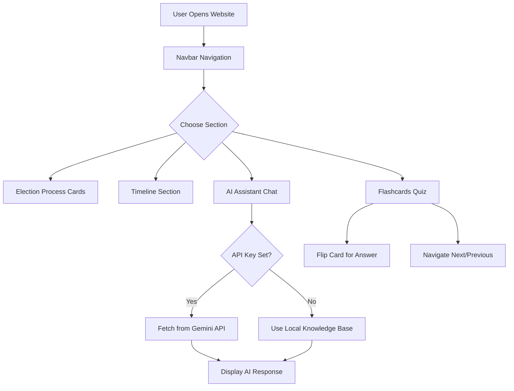
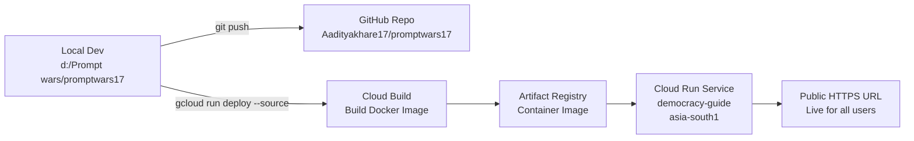

# 🗳️ DemocracyGuide — Indian Election Assistant

> An interactive, AI-powered web application that educates citizens about the Indian electoral process, political landscape, Parliament, and upcoming elections — all in a beautiful, accessible interface.

🌐 **Live Demo:** [https://democracy-guide-588581674963.asia-south1.run.app](https://democracy-guide-588581674963.asia-south1.run.app)
📁 **GitHub:** [https://github.com/Aadityakhare17/promptwars17](https://github.com/Aadityakhare17/promptwars17)

---

## 📖 About The Project

**DemocracyGuide** is a fully static, responsive web application built with pure HTML, CSS, and JavaScript. It serves as a one-stop educational platform for Indian citizens who want to understand:

- 🏛️ How elections work in India
- 📅 The timeline and process of voting
- 💡 Key political facts (PM, President, Parliament seats)
- 🃏 Election terminology via interactive Flashcards
- 🤖 Real-time answers from a Gemini AI-powered chatbot assistant

The project was themed around the **Indian National Flag** — using Saffron, White, Green, and Navy Blue as the primary color palette — to create a patriotic, clean, and modern UI.

---

## ✨ Features

| Feature | Description |
|---------|-------------|
| 🏠 **Hero Section** | Welcome page with quick navigation |
| 📋 **Election Process** | Step-by-step cards explaining how Indian elections work |
| 📅 **Interactive Timeline** | Visual timeline of the election journey from announcement to results |
| 🃏 **Flashcards** | Flip-card quiz to learn key election terms (EVM, VVPAT, ECI) |
| 🤖 **AI Assistant** | Chatbot powered by Google Gemini API for dynamic Q&A |
| 🇮🇳 **Indian Politics KB** | Built-in knowledge base about PM, President, Lok Sabha, Rajya Sabha, parties |
| 📆 **Election Schedule** | Future election years up to 2047 (Lok Sabha & Rajya Sabha) |
| 📱 **Responsive Design** | Works on mobile, tablet, and desktop |

---

## 🏗️ Architecture

### System Overview

```
┌─────────────────────────────────────────────────────────┐
│                     USER BROWSER                        │
│                                                         │
│  ┌──────────┐  ┌──────────┐  ┌──────────┐             │
│  │index.html│  │ style.css│  │script.js │             │
│  │(Structure)│  │ (Design) │  │  (Logic) │             │
│  └──────────┘  └──────────┘  └──────────┘             │
│                      │                                  │
│              ┌───────▼───────┐                         │
│              │  AI Assistant │                         │
│              │   Chatbot     │                         │
│              └───────┬───────┘                         │
└──────────────────────┼──────────────────────────────────┘
                       │ HTTPS API Call (if key set)
                       ▼
         ┌─────────────────────────┐
         │   Google Gemini API     │
         │  gemini-2.0-flash model │
         │  (generativelanguage    │
         │   .googleapis.com)      │
         └─────────────────────────┘
```

### Application Flow



### Deployment Pipeline



---

## 🛠️ Tech Stack

| Technology | Purpose |
|------------|---------|
| **HTML5** | Page structure and semantic layout |
| **Vanilla CSS3** | Styling, animations, glassmorphism, responsive design |
| **JavaScript (ES6+)** | Interactivity, async API calls, flashcard logic |
| **Google Gemini API** | AI-powered election chatbot responses |
| **nginx (Alpine)** | Lightweight web server inside Docker container |
| **Docker** | Containerization for consistent deployment |
| **Google Cloud Build** | Automated container image builds |
| **Google Cloud Run** | Serverless, scalable hosting |
| **GitHub** | Version control and source repository |

---

## 🎨 Design System

The app uses an **Indian Flag inspired** color palette:

```
🟠 Saffron   →  #FF9933  (Primary — headings, buttons, accents)
⬜ White      →  #FFFFFF  (Background, cards)
🟢 Green      →  #138808  (Secondary — hover states, badges)
🔵 Navy Blue  →  #000080  (Accent — navbar, links)
```

**Typography:** Google Fonts — `Montserrat` (headings) + `Inter` (body)

**Visual Effects:**
- Glassmorphism cards with `backdrop-filter: blur`
- 3D CSS flip animation on flashcards
- Smooth scroll navigation
- Hover micro-animations on all interactive elements

---

## 🤖 AI Assistant Knowledge Base

The chatbot can answer questions about:

- 👤 **PM of India** — Narendra Modi (BJP, 3rd term 2024)
- 👤 **President of India** — Droupadi Murmu (since July 2022)
- 🏛️ **Lok Sabha** — 543 elected seats (lower house)
- 🏛️ **Rajya Sabha** — 245 members (upper house)
- 🗓️ **Current Elections** — State assembly elections in 2026
- 📅 **Future Schedule** — Lok Sabha: 2029, 2034, 2039, 2044 | Rajya Sabha: every 2 years up to 2046
- 🎂 **2047 Milestone** — India's 100th Independence anniversary
- 🏅 **Political Parties** — BJP, INC, AAP, TMC, DMK, LDF and more
- 🗺️ **State Politics** — Party-wise state control across India
- 📝 **Voter Registration** — How to register via NVSP portal

> When a valid Gemini API key is provided, the assistant uses `gemini-2.0-flash` to answer **any** election-related question dynamically.

---

## 🚀 Getting Started

### Run Locally

```bash
# Clone the repository
git clone https://github.com/Aadityakhare17/promptwars17.git
cd promptwars17

# Option 1: Open directly
start index.html

# Option 2: Serve with npx
npx serve .
# Visit http://localhost:3000
```

### Enable Gemini AI (Optional)

1. Get a free API key from [Google AI Studio](https://aistudio.google.com)
2. Open `script.js`
3. Replace line 58:
   ```js
   const GEMINI_API_KEY = 'YOUR_GEMINI_API_KEY_HERE';
   // Replace with:
   const GEMINI_API_KEY = 'your-actual-key';
   ```

### Deploy to Cloud Run

```bash
# Authenticate
gcloud auth login

# Set project
gcloud config set project YOUR_PROJECT_ID

# Deploy
gcloud run deploy democracy-guide \
  --source . \
  --region asia-south1 \
  --platform managed \
  --allow-unauthenticated \
  --port 8080
```

---

## 📁 Project Structure

```
promptwars17/
├── index.html          # Main HTML — all sections and layout
├── style.css           # All styles, animations, responsive design
├── script.js           # Flashcard logic, chat assistant, Gemini API
├── Dockerfile          # nginx container config for Cloud Run
├── .dockerignore       # Exclude unnecessary files from Docker build
└── README.md           # This file
```

---

## 🌍 Live Deployment Info

| Property | Value |
|----------|-------|
| **Platform** | Google Cloud Run |
| **Region** | `asia-south1` (Mumbai) |
| **Service Name** | `democracy-guide` |
| **Project** | `prompt17` |
| **URL** | https://democracy-guide-588581674963.asia-south1.run.app |
| **Access** | Public (unauthenticated) |
| **Container** | nginx:alpine |

---

## 🤝 Contributing

Pull requests are welcome! For major changes, please open an issue first.

---

## 📜 License

This project is open source and available under the [MIT License](LICENSE).

---

<div align="center">
  Made with ❤️ for Indian Democracy by <strong>Aaditya Khare</strong><br/>
  🇮🇳 <em>Jai Hind!</em>
</div>
